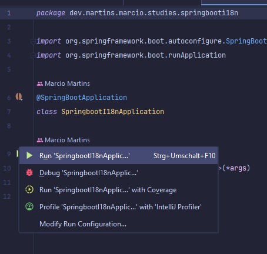
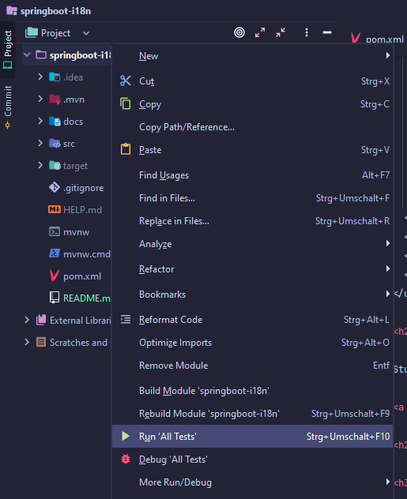

<!--suppress HtmlUnknownAnchorTarget -->


<a href="https://spring.io/" title="Go to spring.io website"></a>
<a href="https://maven.apache.org/" title="Go to apache.org website"></a>

<h2 id="table-of-contents">⤴️ Table of Contents</h2>

<ul>
  <li>❓ <a href="#about" title="Go to about bookmark">About</a></li>
  <li>
    🏃 <a href="#how-to-run" title="Go to how to run bookmark">How to Run</a>
    <ul>
      <li>
        <a href="#how-to-run-intellij" title="Go to how to run intellij bookmark">Intellij</a>,
        <a href="#how-to-run-maven" title="Go to how to run maven bookmark">Maven</a>,
        <a href="#how-to-run-docker" title="Go to how to run docker bookmark">Docker</a>
      </li>
    </ul>
  </li>
  <li>
    🚦 <a href="#how-to-test" title="Go to how to test bookmark">How to Test</a>
    <ul>
      <li>
        <a href="#how-to-test-intellij" title="Go to how to test intellij bookmark">Intellij</a>,
        <a href="#how-to-test-maven" title="Go to how to test maven bookmark">Maven</a>,
        <a href="#how-to-test-docker" title="Go to how to test docker bookmark">Docker</a>
      </li>
      <li><a href="#how-to-test-manually" title="Go to how to test manually bookmark">Manually</a></li>
    </ul>
  </li>
  <li>📖 <a href="#docs" title="Go to documentation bookmark">Documentation</a></li>
  <li>🔧 <a href="#tools" title="Go to about bookmark">Tools</a></li>
  <li>📖 <a href="#references" title="Go to about bookmark">References</a></li>
</ul>

<h2 id="about">❓ About</h2>

Study about Spring Boot with i18n and Problem Detail

<a href="#table-of-contents" title="Go to table of contents">Back to Top</a>

<h2 id="how-to-run">🏃 How to Run</h2>

The docker-compose should be at version 2.21 or greater.

<h3 id="how-to-run-intellij">IntelliJ</h3>

Find the main file
at: <a href="./src/main/kotlin/dev/martins/marcio/studies/springbooti18n/SpringbootI18nApplication.kt" title="Go to file SpringbootI18nApplication.kt">
src/main/kotlin/dev/martins/marcio/studies/springbooti18n/SpringbootI18nApplication.kt</a>

Execute it clicking on the "play" button and after that in Run.



In case of an error for missing dependencies, reload it with maven command "Reload All Maven Projects":

<a href="#table-of-contents" title="Go to table of contents">Back to Top</a>

<h3 id="how-to-run-maven">Maven</h3>

```shell
mvn spring-boot:run
```

<a href="#table-of-contents" title="Go to table of contents">Back to Top</a>

<h3 id="how-to-run-docker">Docker</h3>

```shell
docker run --rm -v $PWD/src:/src -v $PWD/pom.xml:/pom.xml -v $PWD/config:/config -v data:/root/.m2 -p 8080:8080 maven:3.8.8-eclipse-temurin-21-alpine mvn spring-boot:run
```

<a href="#table-of-contents" title="Go to table of contents">Back to Top</a>

<h2 id="how-to-test">🚦 How to Test</h2>

<h3 id="how-to-test-intellij">Intellij</h3>

To run all the unit and integration tests, right-click on the root folder and select "Run All Tests".



<a href="#table-of-contents" title="Go to table of contents">Back to Top</a>

<h3 id="how-to-test-maven">Maven</h3>

Unit tests:

```shell
mvn test
```

Unit tests + Integration tests:

```shell
mvn verify
```

<a href="#table-of-contents" title="Go to table of contents">Back to Top</a>

<h3 id="how-to-test-docker">Docker</h3>

Unit tests:

```shell
docker run --rm -v $PWD/src:/src -v $PWD/pom.xml:/pom.xml -v $PWD/config:/config -v data:/root/.m2 -p 8080:8080 maven:3.8.8-eclipse-temurin-21-alpine mvn test
```

Unit tests + Integration tests:

```shell
docker run --rm -v $PWD/src:/src -v $PWD/pom.xml:/pom.xml -v $PWD/config:/config -v data:/root/.m2 -p 8080:8080 maven:3.8.8-eclipse-temurin-21-alpine mvn verify
```

<a href="#table-of-contents" title="Go to table of contents">Back to Top</a>

<h3 id="how-to-test-manually">Manually</h3>

There are scripts to help you to make requests to the application. Check the steps below:

The application must be <a href="#how-to-run" title="Go to how to run bookmark">running</a>, check
the <a href="#docs" title="Go to documentation bookmark">documentation section</a> for some useful links and check
the <a href="src/test/intellij/scripts" title="Go to intellij scripts folder">intellij http client scripts folder</a>
which already contains requests scripts.

Check <a href="https://www.jetbrains.com/help/idea/http-client-in-product-code-editor.html" title="">IntelliJ Http
Client Documentation</a> about how to set up the private variables. For example:

`http-client.private.env.json`

```json
{
  "development": {
    "person_name": "John Doe",
    "person_age": "18"
  }
}
```

<a href="#table-of-contents" title="Go to table of contents">Back to Top</a>

<h2 id="docs">📖 Documentation</h2>

The application use the HATEOAS principle with HALS and HALS Form. From the root resource it is possible to discover the
api capabilities.

There is also OpenApi documentation:

| Env   | Url                                                                         |
|-------|-----------------------------------------------------------------------------|
| Local | <a href="http://localhost:8080/api-docs">http://localhost:8080/api-docs</a> |

And the open api json is defined at:

| Env   | Url                                                                                 |
|-------|-------------------------------------------------------------------------------------|
| Local | <a href="http://localhost:8080/openapi.json">http://localhost:8080/openapi.json</a> |

<a href="#table-of-contents" title="Go to table of contents">Back to Top</a>

<h2 id="tools">🔧 Tools</h2>

Check the <a href="./docs/HELP.md" title="Go to HELP.md file">HELP.md</a> file with a list of links and articles about
the tools used in this project.

<a href="#table-of-contents" title="Go to table of contents">Back to Top</a>

<h2 id="references">📖 References</h2>

<ul>
  <li>
    <a href="https://simpleicons.org/" title="Go to simpleicons.org website">simpleicons.org</a>
  </li>
  <li>
    Banner created by <a href="https://github.com/marciovmartins" title="Go to Marcio's github">Marcio Martins</a>
    with <a href="https://www.bing.com/images/create" title="Go to Bing Copiloted used in the banner">Bing Copilot</a>
    and <a href="https://www.gimp.org/" title="Go to GIMP website">GIMP</a><br/>
    <blockquote>A person sitting in a desk with a computer with a talking balloon, like in a cartoon, saying the word 'i18n', from Internationalization. The man is a student from Brazil.</blockquote>
    <a href="./docs/assets/readme-banner/bing-copilot-banner.jpeg" title="Go to original bing copilot generated image">original image</a>
  </li>
</ul>

<a href="#table-of-contents" title="Go to table of contents">Back to Top</a>